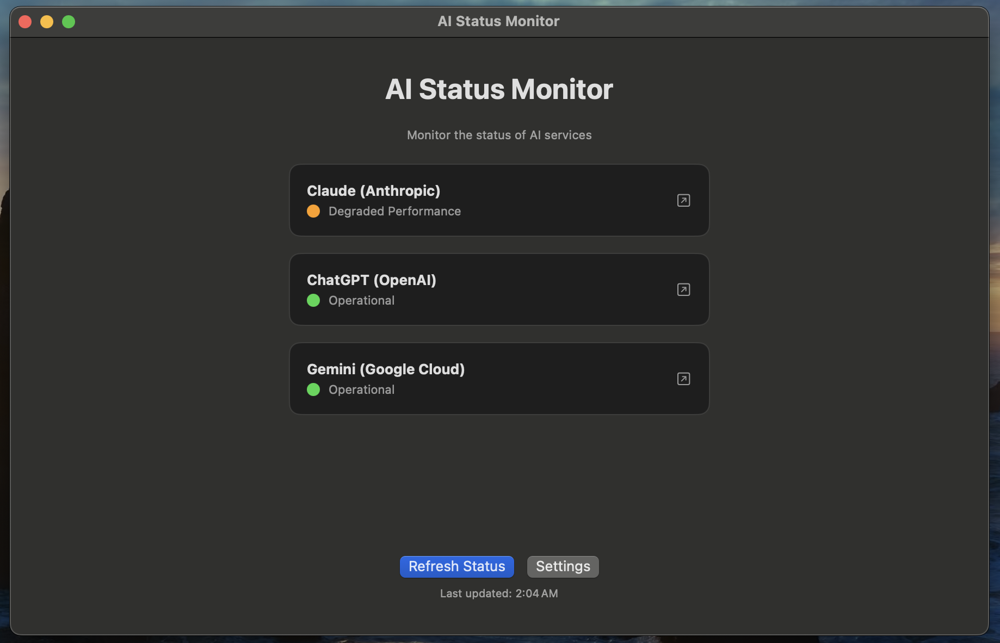
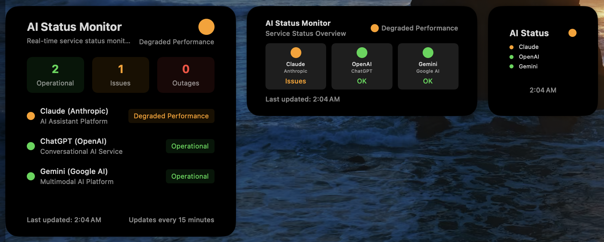
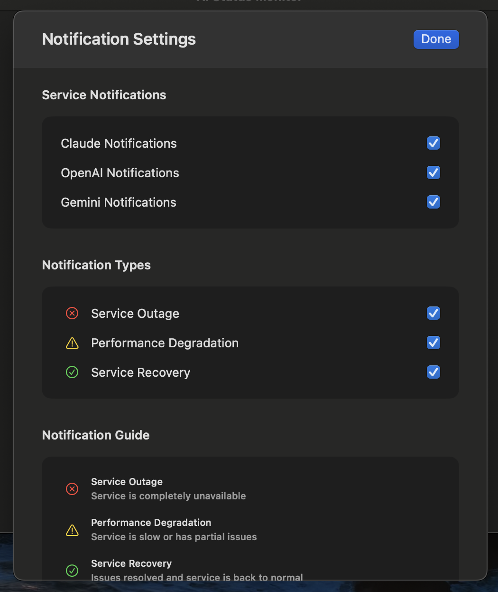

# AI Status Monitor

A native macOS application that monitors the real-time status of popular AI services including Claude (Anthropic), OpenAI, and Google Gemini. The app provides both a main application interface and a convenient home screen widget for quick status checks.

## Screenshots

<div align="center">
  
  <p><em>Main application showing real-time AI service status</em></p>
</div>

<div align="center">
  
  <p><em>Home screen widgets in various sizes</em></p>
</div>

<div align="center">
  
  <p><em>Customizable notification settings</em></p>
</div>

## Overview

AI Status Monitor helps developers and AI enthusiasts stay informed about the operational status of major AI services. With customizable notifications and real-time monitoring, you'll never miss important service updates that might affect your work or projects.

## Features

### 🔍 Real-time Status Monitoring
- **Multi-service tracking**: Monitors Claude (Anthropic), OpenAI, and Google Gemini
- **Automatic updates**: Refreshes status every 5 minutes for both widgets and main app
- **Status indicators**: 
  - 🚨 **Service Outage**: Complete service unavailability
  - ⚠️ **Performance Degradation**: Slow or partial service issues
  - ✅ **Operational**: Normal service operation

### 📱 Native macOS Integration
- **Main Application**: Comprehensive status dashboard with detailed information
- **Home Screen Widget**: Quick status overview in small, medium, or large sizes
- **Menu Bar Integration**: Easy access to status information
- **Native UI**: Follows macOS design guidelines with proper dark/light mode support

### 🔔 Smart Notification System
- **Service-specific notifications**: Toggle notifications for individual services
- **Notification type filtering**: 
  - Service outage alerts
  - Performance degradation warnings
  - Service recovery notifications
- **Contextual alerts**: Different notification styles based on severity
- **Persistent settings**: Preferences saved using UserDefaults

### ⚙️ Customizable Settings
- **Notification preferences**: Fine-tune which alerts you receive
- **Service selection**: Choose which AI services to monitor
- **User-friendly interface**: Clean, intuitive settings panel

## Architecture

### Project Structure
```
AI Status Monitor/
├── AI Status Monitor/              # Main application
│   ├── AI_Status_MonitorApp.swift  # App entry point
│   ├── ContentView.swift           # Main interface
│   ├── StatusMonitor.swift         # Core monitoring logic
│   ├── NotificationSettings.swift  # Settings management
│   ├── SettingsView.swift          # Settings interface
│   ├── ServiceStatus.swift         # Status data models
│   └── RSSFeedParser.swift         # RSS/API parsing utilities
├── AI Status Monitor Widget/       # Widget extension
│   ├── AIStatusWidget.swift        # Widget configuration
│   ├── AIStatusProvider.swift      # Widget data provider
│   ├── AIStatusEntry.swift         # Widget data model
│   └── [Widget Views]/             # Size-specific widget layouts
└── Shared Resources/               # Entitlements and assets
```

### Core Components

#### StatusMonitor
The heart of the application that:
- Fetches status data from multiple APIs
- Processes RSS feeds and JSON responses
- Manages the application state
- Triggers notifications based on status changes
- Provides shared data for both app and widget

#### NotificationSettings
Handles user preferences including:
- Service-specific notification toggles
- Notification type filtering
- Persistent storage via UserDefaults
- Smart notification logic

#### Widget System
- **AIStatusProvider**: Manages widget timeline and data updates
- **Size-specific views**: Optimized layouts for different widget sizes
- **Automatic updates**: Synchronized with main app status

### Data Sources

The application monitors service status through official APIs:
- **Claude (Anthropic)**: RSS feed from status.anthropic.com
- **OpenAI**: JSON API from status.openai.com
- **Google Gemini**: Incidents API from status.cloud.google.com

## Technical Details

### Requirements
- **macOS 13.0+**
- **Xcode 15.0+**
- **Swift 5.9+**
- **Network access** for API calls

### Key Technologies
- **SwiftUI**: Modern declarative UI framework
- **WidgetKit**: Native widget implementation
- **UserNotifications**: System notification integration
- **Foundation**: Core data handling and networking
- **Combine**: Reactive programming for data updates

### Network & Security
- **HTTPS-only**: All API calls use secure connections
- **Sandboxed**: Follows macOS security guidelines
- **Network entitlements**: Properly configured for both app and widget targets
- **Privacy-first**: No user data collection or tracking

## Installation

1. Clone the repository
2. Open `AI Status Monitor.xcodeproj` in Xcode
3. Build and run the application
4. Add the widget to your home screen from the widget gallery

## Usage

### Main Application
1. Launch the app to see the current status of all monitored services
2. Click "Refresh Status" to manually update the information
3. Click "Settings" to customize notification preferences
4. Click on any service card to open its official status page

### Widget
1. Add the widget to your home screen in your preferred size
2. The widget automatically updates every 5 minutes
3. Click the widget to open the main application

### Notifications
1. Grant notification permissions when prompted
2. Configure which services and alert types you want to receive
3. Notifications will appear automatically when status changes occur

## Contributing

This project welcomes contributions! Feel free to:
- Report bugs or request features via GitHub Issues
- Submit pull requests for improvements
- Suggest new AI services to monitor

## License

This project is licensed under the MIT License - see the [LICENSE](LICENSE) file for details.

---

*Built with ❤️ for the AI community*